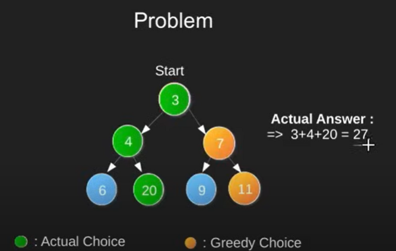

# CashFlow-minimizer-using-ShortestPathAlgorithm-Splitwise
The CashFlow Minimizer project aims to streamline and optimize financial transactions within a given network using a Shortest Path Algorithm. This innovative solution is designed to minimize cash flow within a complex financial network, ultimately reducing transaction costs and improving overall financial efficiency. The modern application Splitwise uses the same algorithm and works on the same principle. 
# Getting started

For example, if the following weighted directed graph represents some people and the arrows represent debts between them (Alice owes Bob $20 and Charlie $5, Bob owes Charlie $10, etc.):

How to pick the first person? To pick the first person, calculate the net amount for every person(Alice, bob, charlie) where net amount is obtained by subtracting all debts (amounts to pay) from all credits (amounts to be paid). Once net amount for every person is evaluated, find two persons with maximum and minimum net amounts(here it is ALice (minimum), charlie(maximum)). These two persons are the most creditors and debtors. The person with minimum of two is our first person to be settled and removed from list. Let the minimum of two amounts be x. We pay ‘x’ amount from the maximum debtor to maximum creditor and settle one person. If x is equal to the maximum debit, then maximum debtor is settled, else maximum creditor is settled.

There's no sense in $10 making its way from Alice to Bob and then from Bob to Charlie if Alice could just give it to Charlie directly.

The goal, then, in the general case is to take a debt graph and simplify it (i.e. produce a new graph with the same nodes but different edges).

# Algorithm used 
Shortest path algorithm -- 
A shortest path algorithm, is designed to find the most efficient path or route between two points in a graph. The goal is to minimize a certain metric, such as distance, time, or cost, while navigating through the edges of the graph.
Two common algorithms for finding the shortest path are Dijkstra's algorithm and the Bellman-Ford algorithm, as mentioned earlier. Dijkstra's algorithm is particularly effective when dealing with graphs with non-negative weights, while the Bellman-Ford algorithm is more versatile and can handle graphs with negative weights.

The algorithm we used here also follows Greedy algorithm 
Greedy algorithm -- An algorithm paradigm that follows problem solving approach of making the locally optimal choice of solution at each stage with the hope of finding a global optimum solution.
Though there are pro's and con's. 
Con's : There are very few globally optimum solutions.  

So, when to use ?
1. Greedy- choice property : A global optimum can be arrived at by selecting a local optimum
2. Optimal Substructure: An optimal solution to the problem contains an optimal solution to sub problems.
Also you cant go back to in greeedy unlike dynamic programming. 
# Real time application

# SPLITWISE APPLICATION 
Splitwise is a popular expense-sharing application that helps friends, roommates, and groups of people track and split shared expenses. The application simplifies the complexities of dividing expenses by employing a simplified algorithmic approach.
Splitwise uses the same approach to do the calculaitons. So, in this way we can conclude that the algorithms real world application is met. 

