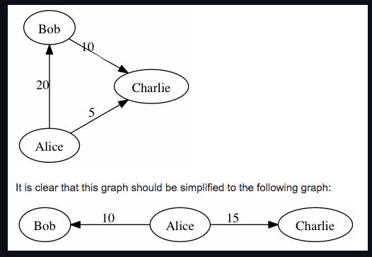

# CashFlow-minimizer-using-ShortestPathAlgorithm-Splitwise
The CashFlow Minimizer project aims to streamline and optimize financial transactions within a given network using a Shortest Path Algorithm. This innovative solution is designed to minimize cash flow within a complex financial network, ultimately reducing transaction costs and improving overall financial efficiency. The modern application Splitwise uses the same algorithm and works on the same principle. 
# Getting started

